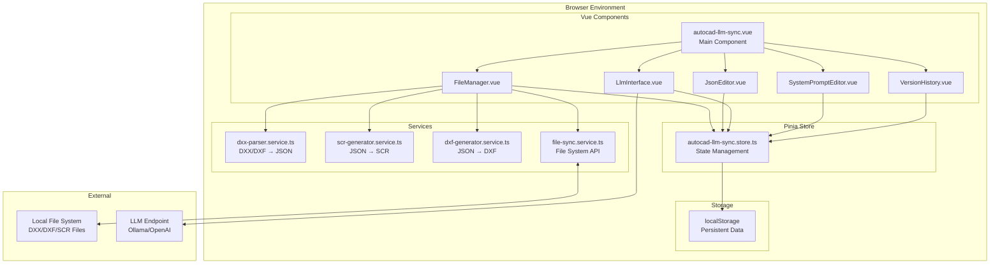
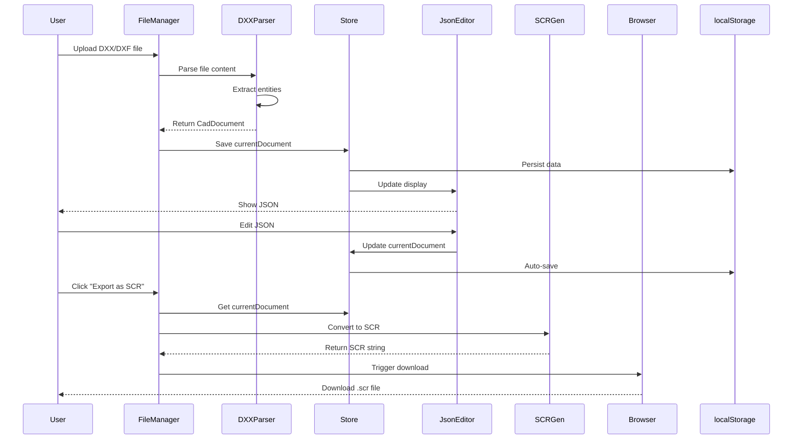
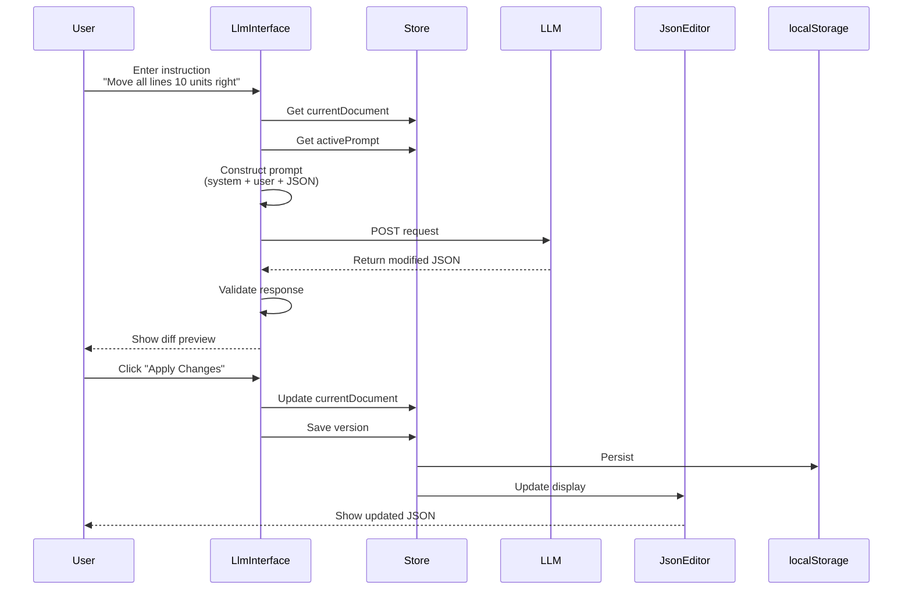
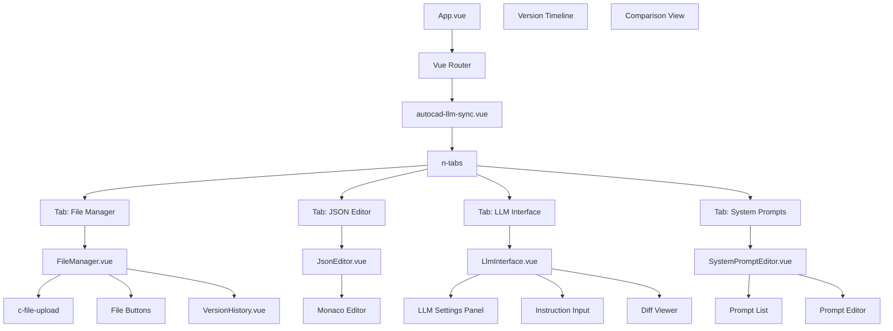
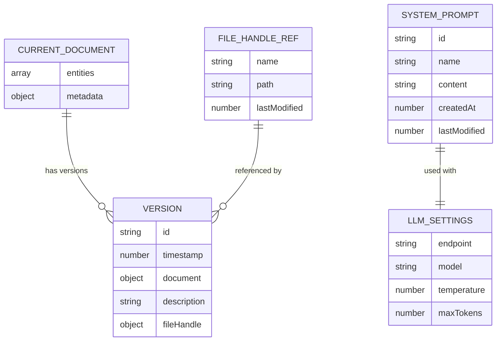
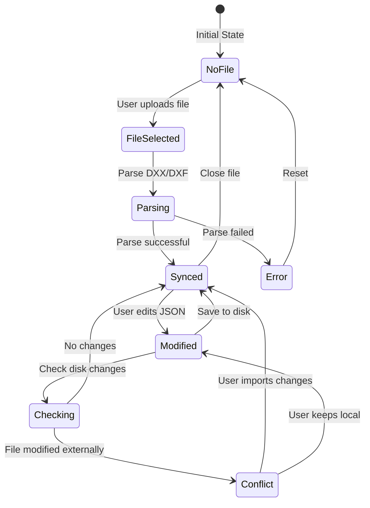
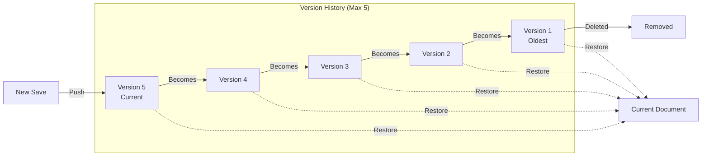
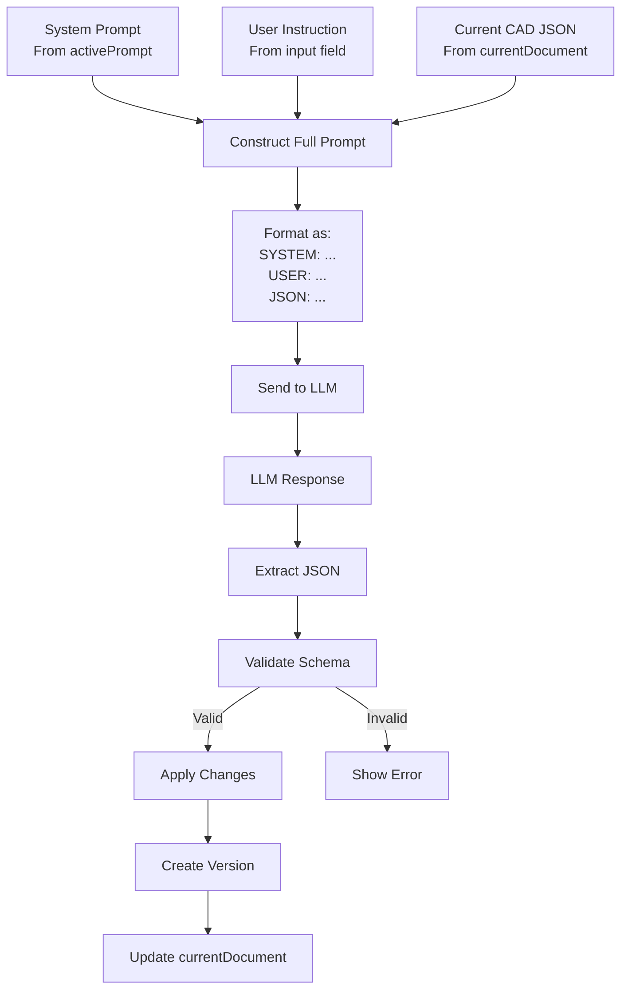
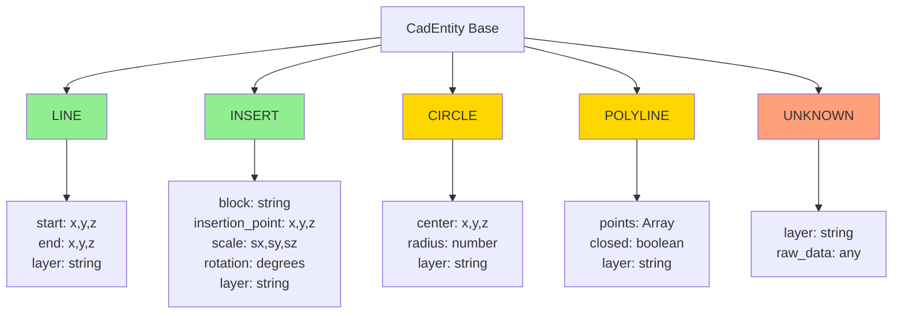
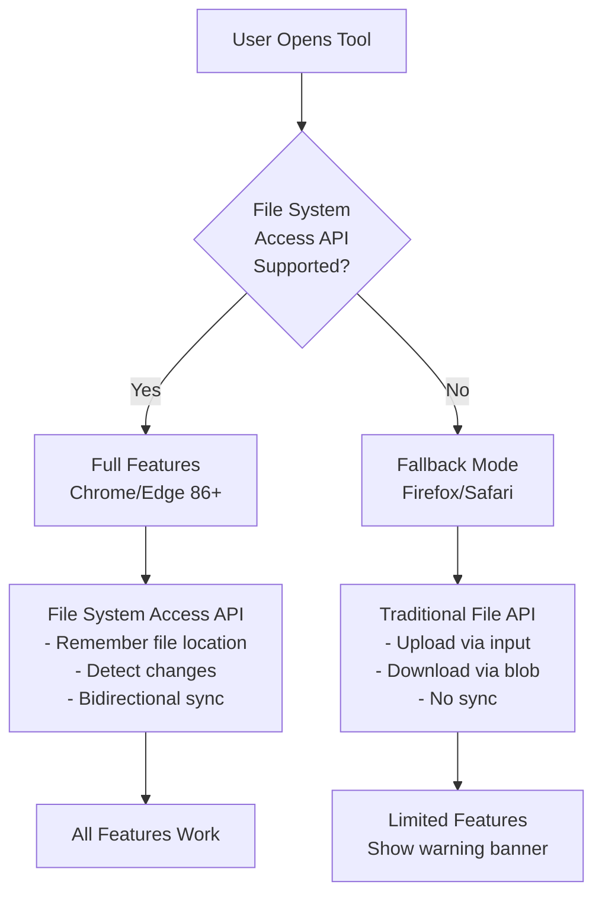

# AutoCAD LLM Sync - Architecture Diagrams

## System Architecture

## Data Flow - File Upload to Export

## Data Flow - LLM Interaction

## Component Hierarchy

## LocalStorage Schema

## File System Sync Flow

## Version History Management

## LLM Prompt Construction

## Entity Type Support (Extensible)

## Browser Compatibility Strategy

---

**Legend:**
- 🟢 Green: Implemented in MVP
- 🟡 Yellow: Post-MVP enhancement
- 🔴 Red: Fallback/error state

